# Project 4 - Design & Plan

Your Team Name: Brown Giraffe

## Milestone 1, Part II: Client Selection

### Client Description

[Tell us about your client. Who is your client? What kind of website do they want? What are their key goals?]

Tom Dilliplane of Cayuga Strength and Condition.
Tom wants a website primarily to display content pertaining to the operation and
accessibility of his business.


[NOTE: If you are redesigning an existing website, give us the current URL and some screenshots of the current site. Tell us how you plan to update the site in a significant way that meets the final project requirements.]

## Milestone 1, Part III: Client Requirements

### Target Audience(s)

[Tell us about the potential audience for this website. How, when, and where would they interact with the website? Get as much detail as possible from the client to help you find representative users.

"Hardcore" strength and conditioning enthusiasts. Beginners are a minority.
Lifters want something simplistic and easy to use: To the point. They care more
about function and content rather than frills.

### Purpose & Content

[Tell us the purpose of the website and what it is all about.]

We design a website to display content in a clear fashion, gain exposure for the
gym, and facilitate communication between the gym and the gym-goers. Additionally,
we would like to add features to make gym operation easier.

### Needs and Wants

[Collect your client's and target audience's needs and wants for the website. Come up with several appropriate design ideas on how those needs may be met. In the **Memo** field, justify your ideas and add any additional comments you have. There is no specific number of needs required for this, but you need enough to do the job.]

Example:
* Needs/Wants #1
  * **Needs and Wants** (What does your client and audience need and want?)
    * Client wants to cater to people who speak different languages.
  * **Design Ideas and Choices** (How will you meet those needs and wants?)
    * Create web-pages manually in multiple languages.
    * Use google translate to auto-translate the site on the fly.
  * **Memo** (Justify your decisions; additional notes.)
    * Creating multiple pages manually would require manual skills, effort and time that we do not have.
    * Using auto-translate using Google-Translate API is an easier way to go. Plus, we would like to learn the Google Translate API.

Needs/Wants #1
  **Needs and Wants**
   * Tom needs to display information about his gym operation and purpose
  **Design Ideas and Choices**
   * Several pages that categorize specifics about his business e.g about us,
   contact, location
  **Memo**
  * We can use content generated by Tom, as well as a google map integration
  for easy directions

  Needs/Wants #2
    **Needs and Wants**
    * Wants to promote his business
    **Design Ideas and Choices**
    * Creating an opportunity to list merchandise, appointment availability,
    and congregate social media presence.
    **Memo**
    * Potential calendar, online store, integrated Facebook feed

    Needs/Wants #3
      **Needs and Wants**
      * Tom wants a website that emphasizes his business philosophy
      **Design Ideas and Choices**
      * Needs to match the "hardcore" nature of his business and users.
      We want to use his store colors of black and marine blue as well as darker
      themes and sharp design. Rugged.
      **Memo**


### Hosting Plan

[What is your plan for hosting your client's website?]

Third party source.

The hosting will be up to Tom and his decisions for hosting the website. We made recommendations of actions that he can take. We go into deeper depth of the steps for hosting for the last section regarding notes to the client available on this document.

### Client's Edits

[Does the client need the ability to edit the site after the end of the semester? If **Yes**, tell us how you site fit your client's need. If **No**, write down N/A.]

Yes, we can solve this by using an admin account that only shows edit buttons.
We can keep display elements simple, to make them easier to edit.

### Information Architecture, Content, and Navigation

[Lay out the plan for how you'll organize the site and which content will go where. Note any content (e.g., text, image) that you need to make/get from the client.]

[Note: As with the Needs and Wants table, there is no specific amount to write here. You simply need enough content to do the job.]

Example:
* Content #1
  * **Main Navigation** (List your site's navigation here.)
    * Portfolio
  * **Sub-Categories** (List any sub-categories of under the main navigation.)
    * Websites
    * Mobile Apps
    * Tablets
  * **Content** (List all the content corresponding to main navigation and sub-categories.)
    * *Portfolio*: list all the projects (as images) this client has worked on. When the image is hovered over, display a description of the project; add a search function to enable users search for specific projects;
    * *Websites*: showcase all the websites designed by the client, with thumbnail images and a brief description for each design;
    * *Mobile Apps*: showcase all the mobile apps designed by the client, with thumbnail images and a brief description for each design;
    * *Tablets*: showcase all the tablet applications designed by the client, with thumbnail images and a brief description for each design;

Content #1
  **Main Navigation**
  * Home page
  **Sub-Categories**
  * location
  * Hours of operation
  * Gym philosophy
  **Content**
  * Location - Google Map integration
  * Hours of operation
  * Gym philosophy

  Content #2
    **Main Navigation**
    * About us
    **Sub-Categories**
    * Who we are
    * Contact Us
    **Content**
    * Who We are - Staff & Bios
    * Contact us - Contact information

    Content #3
      **Main Navigation**
      * Calendar
      **Sub-Categories**
      * Calendar
      * appointments
      **Content**
      * Calendar - Appointment availability
      * Appointments - Email confirmation to both parties, and update the Calendar

      Content #4
        **Main Navigation**
        * merchandise
        **Sub-Categories**
        **Content**
        * In house shirts and other Products

        Content #5
          **Main Navigation**
          * Updates
          **Sub-Categories**
          * Facebook feed
          * User reviews
          * Fitness tips

          **Content** #6
          * Facebook feed from existing page
          * User uploaded reviews
          * Admin posted fitness tips

        /** THINKING ABOUT account page for appointments and store


### Interactivity

[What interactive features will your site have? What PHP elements will you include?]

[Much of this is up to you, however, implementing a login system is **required**. Logging in should not be required to view the site, however it must unlock extra functionality, e.g., admin functionality, comment posting, etc.]

Lots of content editing capability for admin (Tom Dilliplane). This includes "Fitness Tip
of the Day/Week/Month" as well as staff bios and pictures. This way Tom can keep
his website current.

Users should be able to make and delete their own appointments, post and delete
reviews, as well as view merchandise. This way users can be more efficient in
scheduling and attending workouts, as well as promote the business.

[Also, describe how the interactivity connects with the needs of the clients/target audience.]

### External Code

[What libraries (e.g. editor.js, jQuery Cookie, Image Sliders, jQuery) are you planning to use for the site? What do you have to do to incorporate those libraries? How much of your own code will satisfy the project requirements?]

Most of the code will be our own, however, we will need to incorporate several
APIs such as Google Maps, Calender, and Facebook feeds.

### Scale

[How large will the site be (approximate number of pages) and how many hours of work will be required to complete it?]

The website should be about 5 pages. We estimate 75 to 100 hours total to complete
## Milestone 1, Part IV: Work Distribution

[Describe how each of your responsibilities will be distributed among your group members.]

There is lots of content to organize. David and Paula will spearhead organization
and communication with Tom on that front. William will collaborate David and Paula
on how admin editing of content will look.

Tom stressed his desire for his website's aesthetic to match his philosophy and
customer base. Grace will spearhead CSS design with collaboration with David and
Paula to make sure each element is well represented for its use.

There is lots of integration with outside APIs as well as plenty of internal
internal interaction. William will spearhead these tasks with assistance from the
whole group. Planning here is key.

At the end of the first week we want to have a skeleton website, with comments and
pseudocode so we are aware of what lies ahead.

By the end of the second week, we want to have basic functionality, and have Content
elements in place.

By  the end of the third week, we want to have full or almost full functionality,
as well as flesh content and styling.

By the fourth week, we want all major bugs taken care of.

By the end of the fifth week, the styling and functionality should be complete.

[Set internal deadlines. Determine your internal dependencies. Whose task needs to be completed first in order for another person's task to be relevant? Be specific in your task descriptions so that everyone knows what needs to be done and can track the progress effectively. Consider how much time will be needed to review and integrate each other's work. Most of all, make sure that tasks are balanced across the team.]

## Milestone 1, Part V: Additional Comments

[If you feel like you haven't fully explained your design choices, or if you want to explain some other functions in your site (such as special design decisions that might not meet the final project requirements), you can use this space to justify your design choices or ask other questions about the project and process.]


## Milestone 2, Part I: PHP Interactivity

[Describe here what you plan to do for your PHP Interactivity requirement.]

Login
We will have users login through a form
the form will collect the username and match it to the database
the password will also have to be matched
Will display the name of the account logged in
When logged in an active cookie session will be collected


Logout
We will have the user be able to click to Logout
this will delete the active session
A message will be displayed to the user telling them that they are logged out

Reviews
We will have users be able to add reviews
The reviews will be submitted by the user  
Only the user that submitted a review will be able to edit their past review
This will be done with an edit button displayed next to the previous review
So all the PHP for reviews will consist of adding, editing, and deleting

Appointments
Users will have the ability to view a calendar and add appointments at the gym
The user can only add an appointment to an open slot
Also, the user will have the ability to delete an appointment
Only a user that created a workout appointment can delete them

User Create New Account
User will be able to create new account
Email must not belong to previous user, user writes their name, and password
If the email is valid and does not belong to previous account the new account will be created and information inserted into database
The user may now login to the account now that they are created


## Milestone 2, Part II: Sketches, Navigation & Wireframes

### Sketches

[Insert your sketches here.]
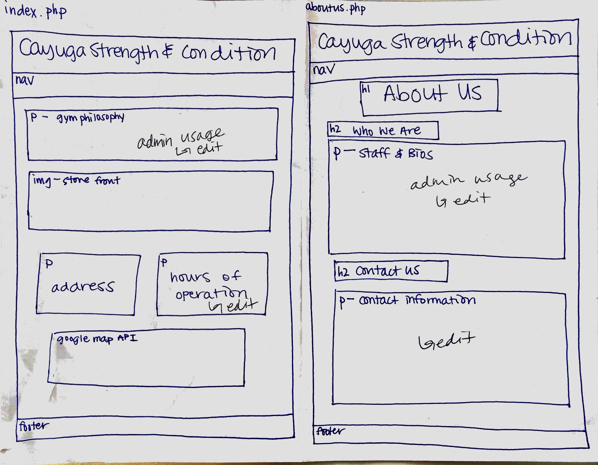
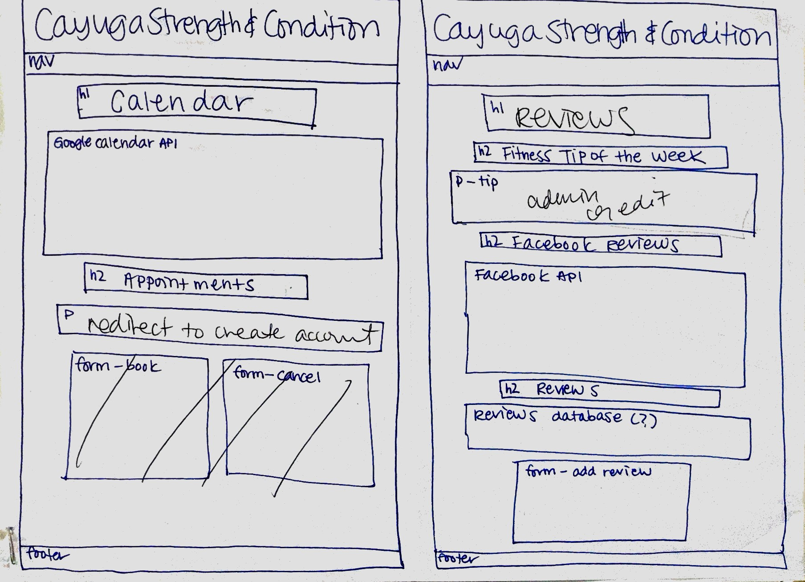
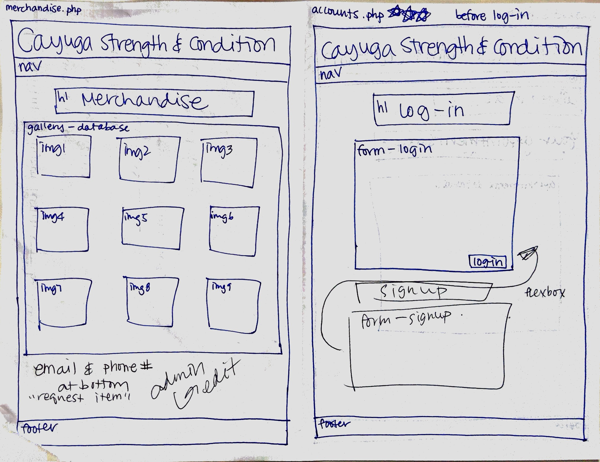
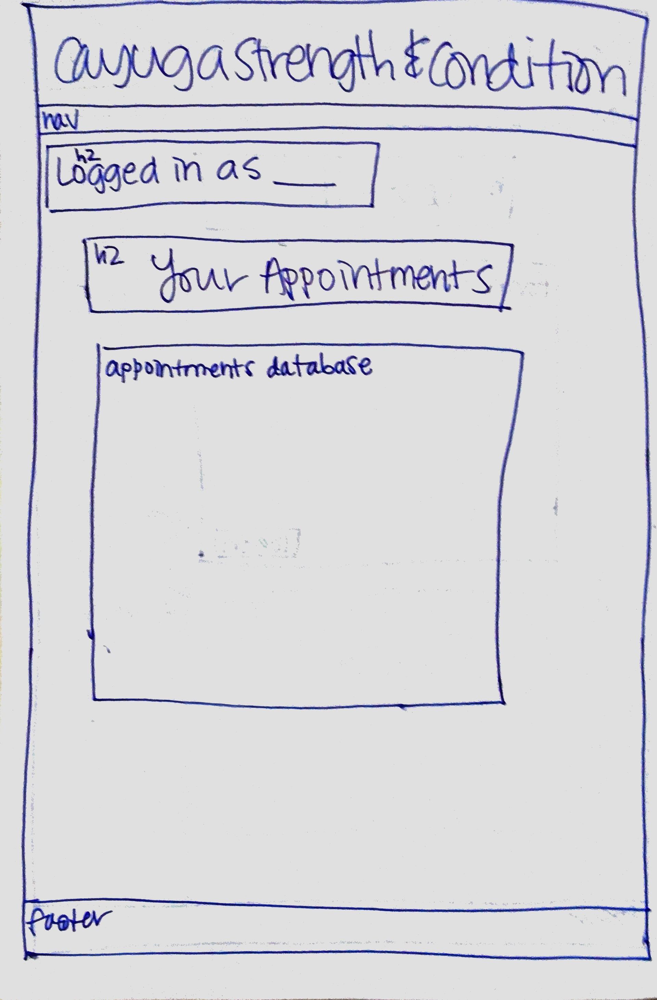
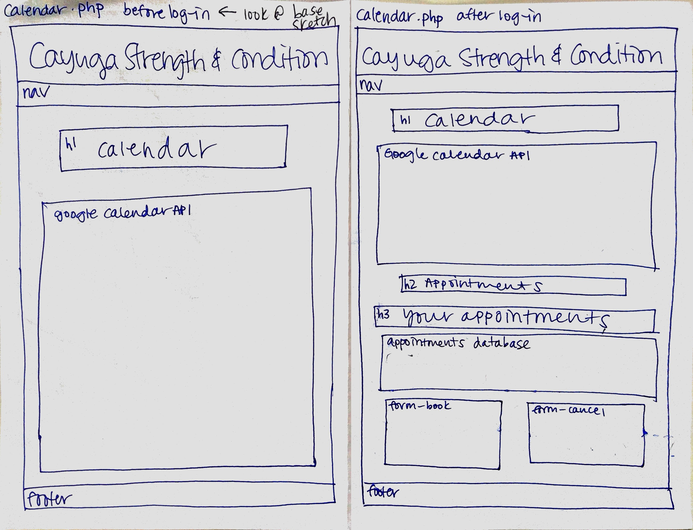
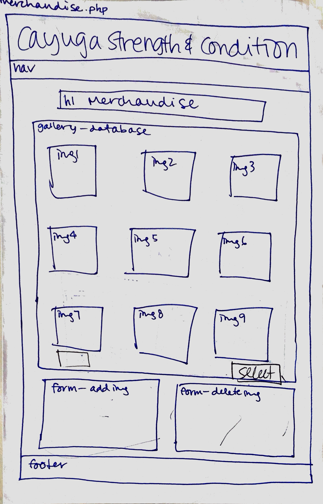
### Navigation

[What will be your top-level pages and your sub-pages for those top-level pages? What will your website's navigational structure?]

[Tip: If you use card sorting for your navigation, show us that work by including a picture!]

Example:
* Home
* About Us
* Calendar
* Reviews
* Merchandise
* Sign Up/Account

### Wireframes

[Insert your wireframes here.]
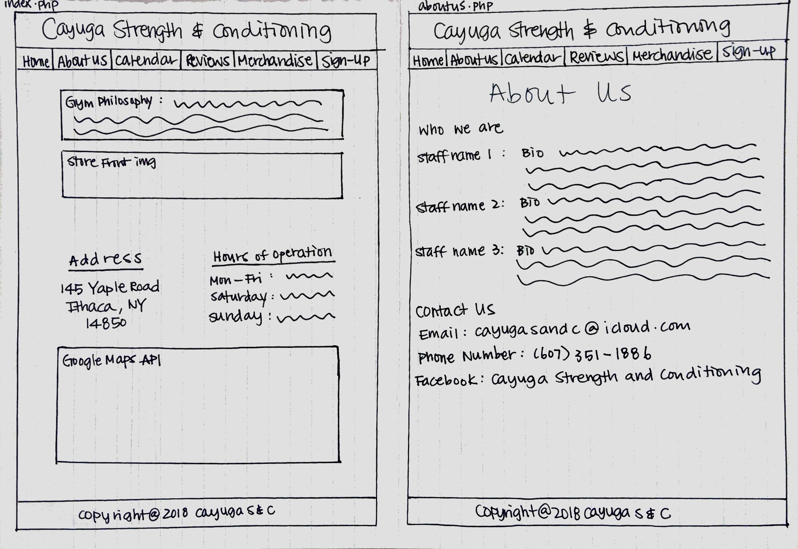
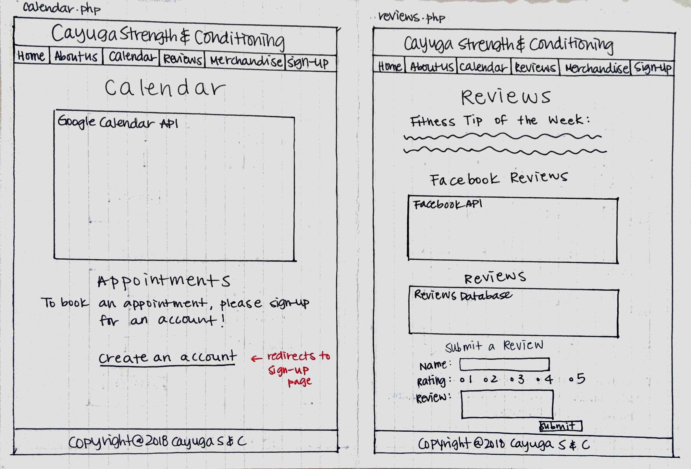
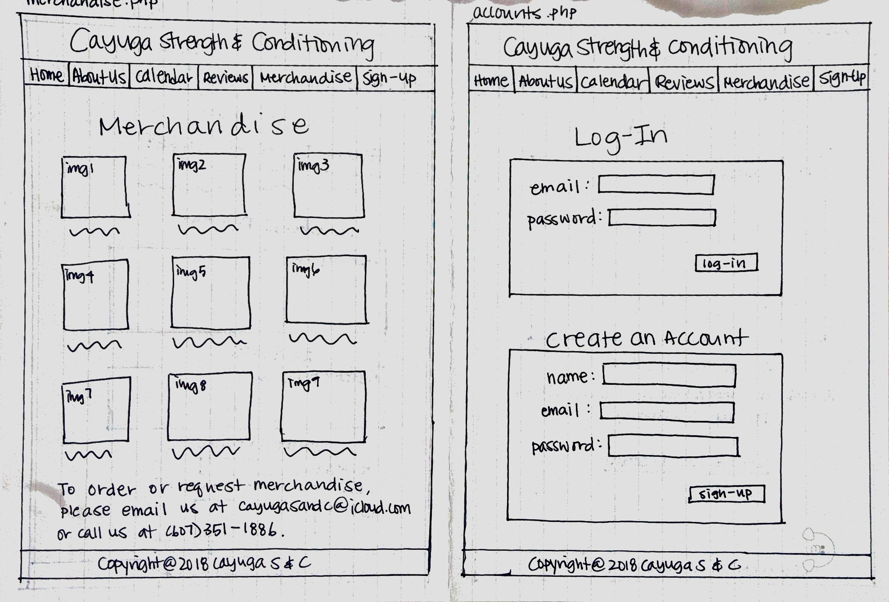
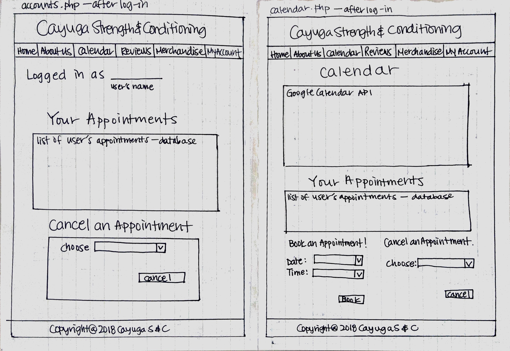
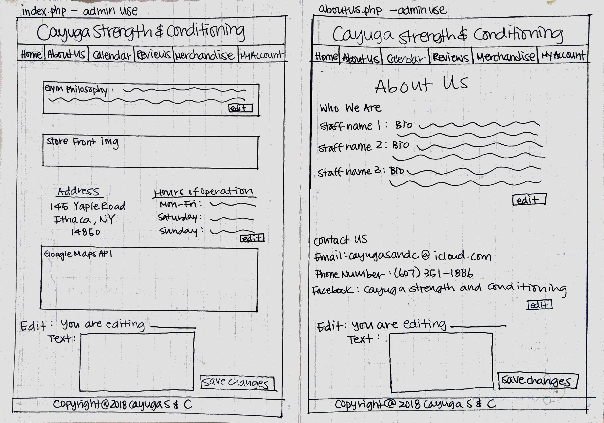
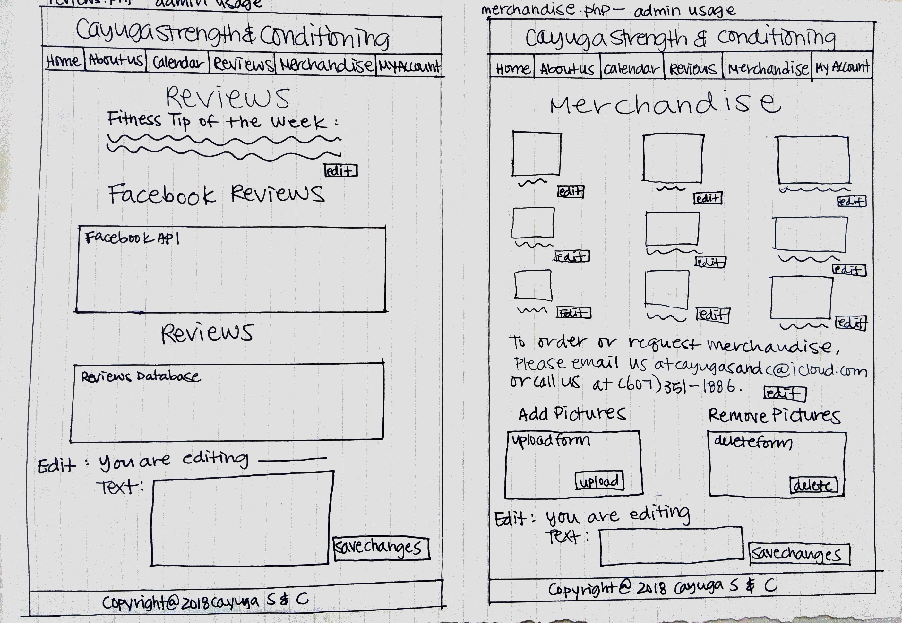


## Milestone 2, Part III: Evaluate your Design

[Use the GenderMag method to evaluate your wireframes.]

[Pick a persona that you believe will help you address the gender bias within your design.]

I've selected **Patricia** as my persona.

I've selected my persona because... Patricia represents what we see as our primary audience based
on her technological capabilities. However, because our website is for a strength and conditioning
gym, it runs the risk of being bias towards males, and therefore Patricia will help us avoid
that in our designs.

### Tasks

[You will need to evaluate at least 3 tasks (known as scenarios in the GenderMag literature). List your tasks here. These tasks are the same as the task you learned in INFO/CS 1300.]

[For each task, list the ideal set of actions that you would like your users to take when working towards the task.]

Task 1: Make an appointment with a personal trainer

  1. Sign in to your account
  2. Navigate to the 'Calendar' page
  3. Check availability on the page's calendar
  4. Book desired time slot for an appointment

Task 2: Add a review to the website

  1. Sign in to your account (if no account, can leave anonymous review)
  2. Navigate to the 'Updates' page
  3. Fill out review form

Task 3: Find out whether there is a t-shirt available for sale in size S

  1. Navigate to 'Merchandise' page
  2. Look at available t-shirts and sizes
  3. If t-shirt size is not available, contact the gym through their email

### Cognitive Walkthrough

[Perform a cognitive walkthrough using the GenderMag method for all of your Tasks. Use the GenderMag template in the <documents/gendermag-template.md> file.]

#### Task 1 - Cognitive Walkthrough

[copy the GenderMag template here and conduct a cognitive walkthrough to evaluate your design (wireframes).]

[You may need to add additional subgoals and/or actions for each task.]

**Task name: Make an appointment with a personal trainer**

**Subgoal #1: Navigate to 'Calendar' page**
  - Will *Patricia* have formed this sub-goal as a step to their overall goal?
    - Yes, maybe or no: [*yes*/maybe/no]
    - Why? (Especially consider [persona name]'s Motivations/Strategies.)
        *Patricia is reflective in her choices, and the 'Calendar' page on the navigation
        bar is the most logical page to visit in order to book an appointment*

**Action #1: Click on 'Calendar' link on the navigation bar**
  - Will *Patricia* know what to do at this step?
    - Yes, maybe or no: [*yes*/maybe/no]
    - Why? (Especially consider [persona name]'s Knowledge/Skills, Motivations/Strategies, Self-Efficacy and Tinkering.)
      *This first step is intuitive to anyone with any computer experience*

      - If [persona name] does the right thing, will she know that she did the right thing, and is making progress towards her goal?
        - Yes, maybe or no: [*yes*/maybe/no]
        - Why? (Especially consider [persona name]'s Self-Efficacy and Attitude toward Risk.)
        *Appointment form will appear below the calendar*

**Subgoal #2: Check availability on the calendar**
  - Will [persona name] have formed this sub-goal as a step to their overall goal?
    - Yes, maybe or no: [*yes*/maybe/no]
    - Why? (Especially consider [persona name]'s Motivations/Strategies.)
      *We are placing the calendar above the appointment form so that users can't
      miss it. Unavailabilities will be clearly displayed as well*

**Action #1: Find the day you are interested in booking on the calendar**
	- Will [persona name] know what to do at this step?
    - Yes, maybe or no: [*yes*/maybe/no]
    - Why? (Especially consider [persona name]'s Knowledge/Skills, Motivations/Strategies, Self-Efficacy and Tinkering.)
      *Calendars are not limited to computer usage, therefore she will have previous
      experience with one*

  - If [persona name] does the right thing, will she know that she did the right thing, and is making progress towards her goal?
    - Yes, maybe or no: [*yes*/maybe/no]
    - Why? (Especially consider [persona name]'s Self-Efficacy and Attitude toward Risk.)
      *She will recognize the date she is interested in on a generic calendar*


**Action #2: Check whether the calendar shows that day as being fully booked or as having availability open**
  - Will [persona name] know what to do at this step?
    - Yes, maybe or no: [*yes*/maybe/no]
    - Why? (Especially consider [persona name]'s Knowledge/Skills, Motivations/Strategies, Self-Efficacy and Tinkering.)
      *The calendar will show other booked appointments on different days, so she will
      be able to recognize that the calendar is displaying availabilities*

  - If [persona name] does the right thing, will she know that she did the right thing, and is making progress towards her goal?
    - Yes, maybe or no: [*yes*/maybe/no]
    - Why? (Especially consider [persona name]'s Self-Efficacy and Attitude toward Risk.)
      *Her desired day will show up as being either fully booked or as having availability,
      so she will know whether she can book an appointment on that day*

**Subgoal #3: Sign in to your account**
  - Will *Patricia* have formed this sub-goal as a step to their overall goal?
    - Yes, maybe or no: [*yes*/maybe/no]
    - Why? (Especially consider [persona name]'s Motivations/Strategies.)
      *The appointment will clearly prompt users to either log in or create an account
      before booking an appointment*

**Action #1: Find log-in form at the top right corner of the page**
	- Will [persona name] know what to do at this step?
    - Yes, maybe or no: [*yes*/maybe/no]
    - Why? (Especially consider [persona name]'s Knowledge/Skills, Motivations/Strategies, Self-Efficacy and Tinkering.)
      *Appointment form will direct user to log in at the top of the page if they
      haven't done so already*

  - If [persona name] does the right thing, will she know that she did the right thing, and is making progress towards her goal?
    - Yes, maybe or no: [*yes*/maybe/no]
    - Why? (Especially consider [persona name]'s Self-Efficacy and Attitude toward Risk.)
      *She will see the log in form*

**Action #2: If account already exists, fill out log-in form with username and password**
  - Will [persona name] know what to do at this step?
    - Yes, maybe or no: [*yes*/maybe/no]
    - Why? (Especially consider [persona name]'s Knowledge/Skills, Motivations/Strategies, Self-Efficacy and Tinkering.)
      *Many websites implement accounts, so she should be familiar with the generic
      log in process*

  - If [persona name] does the right thing, will she know that she did the right thing, and is making progress towards her goal?
    - Yes, maybe or no: [*yes*/maybe/no]
    - Why? (Especially consider [persona name]'s Self-Efficacy and Attitude toward Risk.)
      *A message will let her know whether she has successfully logged in or not*

**Action #3: If no account exists, follow sign up link under log-in form to register for an account**
  - Will [persona name] know what to do at this step?
    - Yes, maybe or no: [*yes*/maybe/no]
    - Why? (Especially consider [persona name]'s Knowledge/Skills, Motivations/Strategies, Self-Efficacy and Tinkering.)
      *Instructions on the form to sign up for an account will help her successfully
      create one*

  - If [persona name] does the right thing, will she know that she did the right thing, and is making progress towards her goal?
    - Yes, maybe or no: [*yes*/maybe/no]
    - Why? (Especially consider [persona name]'s Self-Efficacy and Attitude toward Risk.)
      *A message will let her know whether she has successfully created an account or not*

**Subgoal #4: Fill out the appointment form for the desired day**
  - Will [persona name] have formed this sub-goal as a step to their overall goal?
    - Yes, maybe or no: [*yes*/maybe/no]
    - Why? (Especially consider [persona name]'s Motivations/Strategies.)
      *This is her end goal, so she will know this is the last step to complete*

**Action #1: Select the desired time and date for the appointment**
  - Will [persona name] know what to do at this step?
    - Yes, maybe or no: [*yes*/maybe/no]
    - Why? (Especially consider [persona name]'s Knowledge/Skills, Motivations/Strategies, Self-Efficacy and Tinkering.)
      *Our user should have experience with booking appointments, whether it is online
      or not, and our appointment form will let her choose a date in intuitive manner*

  - If [persona name] does the right thing, will she know that she did the right thing, and is making progress towards her goal?
    - Yes, maybe or no: [*yes*/maybe/no]
    - Why? (Especially consider [persona name]'s Self-Efficacy and Attitude toward Risk.)
      *Their desired date and time will appear on the form*

**Action #2: Submit appointment booking request**
  - Will [persona name] know what to do at this step?
    - Yes, maybe or no: [*yes*/maybe/no]
    - Why? (Especially consider [persona name]'s Knowledge/Skills, Motivations/Strategies, Self-Efficacy and Tinkering.)
      *There will be a visible submit button at the bottom of our form*

  - If [persona name] does the right thing, will she know that she did the right thing, and is making progress towards her goal?
    - Yes, maybe or no: [*yes*/maybe/no]
    - Why? (Especially consider [persona name]'s Self-Efficacy and Attitude toward Risk.)
      *A message will echo back the chosen date and time and let the user know that
      the appointment has been successfully booked*

#### Task 2 - Cognitive Walkthrough

**Task name: Leave a review on the website**

**Subgoal #1: Navigate to 'Reviews' page**
  - Will [persona name] have formed this sub-goal as a step to their overall goal?
    - Yes, maybe or no: [*yes*/maybe/no]
    - Why? (Especially consider [persona name]'s Motivations/Strategies.)
      *If the user wants to leave a review, the 'Reviews' page is the most intuitive
      place to navigate to (does not require too much thought process)*

**Action #1: Click on 'Reviews' link on the navigation bar**
  - Will [persona name] know what to do at this step?
    - Yes, maybe or no: [*yes*/maybe/no]
    - Why? (Especially consider [persona name]'s Knowledge/Skills, Motivations/Strategies, Self-Efficacy and Tinkering.)
      *This first step is intuitive to anyone with any computer experience*

    - If [persona name] does the right thing, will she know that she did the right thing, and is making progress towards her goal?
      - Yes, maybe or no: [*yes*/maybe/no]
      - Why? (Especially consider [persona name]'s Self-Efficacy and Attitude toward Risk.)
        *The page will show past reviews and a form to enter your own review*

**Subgoal #2: Fill out review form on the website**
  - Will [persona name] have formed this sub-goal as a step to their overall goal?
    - Yes, maybe or no: [*yes*/maybe/no]
    - Why? (Especially consider [persona name]'s Motivations/Strategies.)
      *This is her main goal, and therefore she will be actively looking for a review form*

**Action #1: Find the review form on the 'Reviews' page**
	- Will [persona name] know what to do at this step?
    - Yes, maybe or no: [*yes*/maybe/no]
    - Why? (Especially consider [persona name]'s Knowledge/Skills, Motivations/Strategies, Self-Efficacy and Tinkering.)
      *form will be visible underneath the website's current reviews, might take some
      scrolling but our user has medium computer-efficacy so should know what to do*

  - If [persona name] does the right thing, will she know that she did the right thing, and is making progress towards her goal?
    - Yes, maybe or no: [*yes*/maybe/no]
    - Why? (Especially consider [persona name]'s Self-Efficacy and Attitude toward Risk.)
      *The review form will clearly show that it is meant to be used to submit
      reviews*

**Action #2: Fill out review to be posted on the site**
  - Will [persona name] know what to do at this step?
    - Yes, maybe or no: [*yes*/maybe/no]
    - Why? (Especially consider [persona name]'s Knowledge/Skills, Motivations/Strategies, Self-Efficacy and Tinkering.)
      *There will be a review entry box, a rating entry box, and an optional name entry box. This is
      standard and will not require the user to log in or be redirected to a different page*

  - If [persona name] does the right thing, will she know that she did the right thing, and is making progress towards her goal?
    - Yes, maybe or no: [*yes*/maybe/no]
    - Why? (Especially consider [persona name]'s Self-Efficacy and Attitude toward Risk.)
      *Form will be filled out - if a required entry box is empty, they will receive feedback
      that it needs to be filled in*

**Action #3: Submit review**
- Will [persona name] know what to do at this step?
  - Yes, maybe or no: [*yes*/maybe/no]
  - Why? (Especially consider [persona name]'s Knowledge/Skills, Motivations/Strategies, Self-Efficacy and Tinkering.)
    *There will be a visible submit button at the bottom of our form*

- If [persona name] does the right thing, will she know that she did the right thing, and is making progress towards her goal?
  - Yes, maybe or no: [*yes*/maybe/no]
  - Why? (Especially consider [persona name]'s Self-Efficacy and Attitude toward Risk.)
    *A message will tell the user they have successfully submitted their review, and
    it will appear with the rest of the reviews on the webpage*

#### Task 3 - Cognitive Walkthrough

**Task name: Find out whether there is a t-shirt available for sale in size S**

**Subgoal #1: Navigate to 'Merchandise' page**
  - Will [persona name] have formed this sub-goal as a step to their overall goal?
    - Yes, maybe or no: [*yes*/maybe/no]
    - Why? (Especially consider [persona name]'s Motivations/Strategies.)
      *If the user wants to buy merchandise, the 'Merchandise' page is the most intuitive
      place to navigate to (does not require too much thought process)*

**Action #1: Click on 'Merchandise' link on the navigation bar**
  - Will [persona name] know what to do at this step?
    - Yes, maybe or no: [*yes*/maybe/no]
    - Why? (Especially consider [persona name]'s Knowledge/Skills, Motivations/Strategies, Self-Efficacy and Tinkering.)
      *This first step is intuitive to anyone with any computer experience*

  - If [persona name] does the right thing, will she know that she did the right thing, and is making progress towards her goal?
    - Yes, maybe or no: [*yes*/maybe/no]
    - Why? (Especially consider [persona name]'s Self-Efficacy and Attitude toward Risk.)
      *The page will show a gallery of t-shirts and other available merchandise, so the
      user will know she is in the right place*

**Subgoal #2: Look at available t-shirts and sizes**
  - Will [persona name] have formed this sub-goal as a step to their overall goal?
    - Yes, maybe or no: [*yes*/maybe/no]
    - Why? (Especially consider [persona name]'s Motivations/Strategies.)
      *the user is interested in finding a specific size for a specific item, so will
      be actively looking at the t-shirts and their corresponding sizes*

**Action #1: Scroll through the available t-shirts and their corresponding sizes**
	- Will [persona name] know what to do at this step?
    - Yes, maybe or no: [*yes*/maybe/no]
    - Why? (Especially consider [persona name]'s Knowledge/Skills, Motivations/Strategies, Self-Efficacy and Tinkering.)
      *if the user is looking for a specific item, scrolling through all available items is
      the most intuitive step, especially for someone with some computer experience*

  - If [persona name] does the right thing, will she know that she did the right thing, and is making progress towards her goal?
    - Yes, maybe or no: [*yes*/maybe/no]
    - Why? (Especially consider [persona name]'s Self-Efficacy and Attitude toward Risk.)
      *they will eventually find the item they are looking for, which will either be marked as
      available or sold out*

**Subgoal #3: If t-shirt size is not available, contact the gym through their email**
  - Will [persona name] have formed this sub-goal as a step to their overall goal?
    - Yes, maybe or no: [*yes*/maybe/no]
    - Why? (Especially consider [persona name]'s Motivations/Strategies.)
      *If the user does not find their item through scrolling, they will have reached
      the bottom of the page. At the bottom of the page, they will be prompted with contact
      information to request specific merchandise products*

**Action #1: Find contact info at the bottom of the merchandise page**
	- Will [persona name] know what to do at this step?
    - Yes, maybe or no: [yes/*maybe*/no]
    - Why? (Especially consider [persona name]'s Knowledge/Skills, Motivations/Strategies, Self-Efficacy and Tinkering.)
      *Although most merchandise pages allow online ordering, this is a small business that has
      limited quantities of each item in stock, and therefore it is not their priority to run
      an online shop on their page. However, the page will clearly state that contacting the gym
      is the next step to take in order to place a merchandise order*

  - If [persona name] does the right thing, will she know that she did the right thing, and is making progress towards her goal?
    - Yes, maybe or no: [*yes*/maybe/no]
    - Why? (Especially consider [persona name]'s Self-Efficacy and Attitude toward Risk.)
      *Our user will find a contact email and phone number stating that in order to place an order
      or request an item, contact should be made*

**Action #2: Email the gym with t-shirt size request**
  - Will [persona name] know what to do at this step?
    - Yes, maybe or no: [*yes*/maybe/no]
    - Why? (Especially consider [persona name]'s Knowledge/Skills, Motivations/Strategies, Self-Efficacy and Tinkering.)
      *the contact information at the bottom of the merchandise page will state that
      emailing the gym directly is the best way to place an order*

  - If [persona name] does the right thing, will she know that she did the right thing, and is making progress towards her goal?
    - Yes, maybe or no: [*yes*/maybe/no]
    - Why? (Especially consider [persona name]'s Self-Efficacy and Attitude toward Risk.)
      *The gym will email back to let our user know whether the order has been placed successfully
      or whether any additional steps are necessary*

### Cognitive Walk-though Results

[Did you discover any issues with your design? What were they? How did you change your design to address the gender-inclusiveness bugs you discovered?]

[Your responses here should be very thorough and thoughtful.]

  *Based on our cognitive walkthrough, we were able to see that in order to reduce the
  possibility for gender bias on our website, it is extremely important to include feedback
  at every step of an action a user might need to take. This includes when submitting forms,
  creating an account, logging in, booking an appointment, etc. We will ensure a general
  increase in redundancy in order to prevent errors on the website. For example, before the
  cognitive walkthrough, we planned on our users checking the calendar for appointment availabilities
  and then filling out the appointment form with an available date. However, after running through the
  task, we realized it would be easier for the user if our appointments form also did not allow for
  booked appointments to be booked at all (instead of leaving it solely to the user to not book a
  booked time slot).

  We also now plan on visually color-coordinating related elements on the website to increase the
  user-friendliness of our website. For example, the forms will be clearly outlined with similar colors
  and grouped visually with like-use elements*

## Milestone 2, Part IV: Database Plan

### Database Schema

[Describe the structure of your database. You may use words or a picture. A bulleted list is probably the simplest way to do this.]

Table: accounts
* field 1: accounts_id (int not null PK AI U)
* field 2: first_name (text not null)
* field 3: last_name (text not null)
* field 4: email (text not null unique)
* field 5: password (text not null)
* field 6: session (text unique)

Table: reviews
* field 1: reviews_id (int not null PK AI U)
* field 2: name (text not null)
* field 3: content (text not null)
* field 4: rating (int not null)

Table: items
* field 1: items_id (int not null PK AI U)
* field 2: item_name (text not null)
* field 3: file_name (text not null)
* field 4: file_ext (text not null)
* field 5: price (int not null)


Table: appointments
* field 1: appointments_id (int not null PK AI U)
* field 2: user_id (int not null)
* field 3: time
* field 4: date

Table: cms
* field 1: id (int not null PK AI U)
* field 2: content (text not null)
* field 3: name (text not null)

Table: staff
* field 1: staff_id (int not null PK AI U)
* field 2: staff_name (text not null)
* field 3: staff_picture_name (text not null)
* field 4: staff_picture_ext (text not null)
* field 5: staff_bio (text not null)

### Database Queries

[Plan your database queries. You may use natural language, pseudocode, or SQL.]

New Reviews
Insert into reviews table the name of reviewer, content, rating
This is inserted into database

Update function of SQL used for:
changing email
name
and password of admin account

Create new account
Insert into database accounts table
first name, last name, email, and password of user


## Milestone 2, Part V: Structure and Pseudocode

### Structure

[List the PHP files you will have. You will probably want to do this with a bulleted list.]

* index.php - main page.
* includes/init.php - stuff that useful for every web page.
* includes/header.php - header and nav bar for every web page
* about.php - contact information, about the gym and staff bios
* calendar.php - calendar showing appointment availability and a form to book appointments
* updates.php - page containing customer reviews, fitness tip of the day, and link to Facebook page feed
* merchandise.php - products that are available for purchase from the gym
* accounts.php - shows a logged in user his/her current appointments (if any) and prompts a non-logged in user to create an account

### Pseudocode

[For each PHP file, plan out your pseudocode. You probably want a subheading for each file.]

#### index.php

```
Pseudocode for index.php
Allow user to add and delete as an admin for tip of the week
The user will be able to delete previous message from database
The user will be able to insert the new message
Message will be submitted and displayed on page
```

#### includes init.php
```
messages = array to store messages for user (you may remove this)

// DB helper functions (you do not need to write this out since they are provided.)

db = connect to db


login the user
check if username matches the database
check if password matches
have warning messages for incomplete form or if both username or password is incorrect
Display to message to user if logged in
Update the account's session to show the current cookie of the user
```

#### include header.php
```
For the navigation bar check if the name matches the current page
Add CSS to the name of the webpage that is currently visited by user

logout the user
for the current user set the session to null
The user will be logged out
Display message to user telling them that they are logged out of the account
```

#### about.php
```
(The about page does not require PHP it is simple HTML)
```

#### calendar.php
```
Add appointment
Be able to see when appointments are available
The PHP only allows a logged in user to to add appointment
Appointment can only be added for times that are free and available
Check to see if no other appointments are in that slot
If slot open let user submit
Insert the appointment information in database for user
Tell user message that appointment was setup successfully


Edit Appointment
For logged in user
User can see appointments that they are signed up for
The user can edit the time of the appointment
This will change the time portion of the SQL database
User will receive message telling time has changed and user will see change


Delete Appointment
For logged in user
User can see appointments that they are signed up for
The user can choose to delete the appointment that belongs to their account
Message will indicate to user that the appointment has been deleted
```

#### reviews.php
```
User that is logged in will be able to add reviews
When adding reviews the user can enter their reviews that are sent to database
The database will store the review information
User can choose to edit only reviews that they had made previously or delete reviews that match their account
Check the database and give edit to only users that have made the review
```

#### merchandise.php  
```
Display the information related to items from database
Information displayed for merchandise item name and price
Display this information as a gallery for the user to view
```

#### account.php
```
Create new account
User adds Name, email, and password
The email must have not been entered previously as it must be unique
If the email exists let user know and send error message
If no error allow user to signup for the account
The database will now include the information provided in the accounts table

Login existing user
User enters email and password
If error tell that the user of error
Errors include not entering a valid email or not filling out email or password part of form
If information of email and password match from the call to the includes/init.php page then the user will be logged in
The PHP will tell the user the message that they had been logged in
```

#### account.php
```
Change Current Email:
Will allow user to update email
User can type in new email
The user can update the account and in SQL will insert new email in

Edit First Name
Will allow user to type in new first name
User hits update button
The database will be updated for inserting the new name


Edit Last Name
Will allow user to type in new first name
User hits update button
The database will be updated for inserting the new name

Change Password:  
Will allow user to type in new password of choice
User hits update button
The database will be updated for inserting the password

```

## Milestone 2, Part VI: Additional Comments

[Add any additional comments you have here.]


## Milestone 3: Updates

[If you make any changes to your plan or design, make a list of the changes here.]


## Milestone 4: Updates

[If you make any changes to your plan or design based on your peers' feedback, make a list of the changes here.]


## Milestone 5: Cognitive Walkthrough

[Copy your tasks here from Milestone 2. Update them if you need to and then conduct another cognitive walkthrough.]

**Task name: Leave a review on the website**

**Subgoal #1: Navigate to 'Reviews' page**
  - Will [persona name] have formed this sub-goal as a step to their overall goal?
    - Yes, maybe or no: [*yes*/maybe/no]
    - Why? (Especially consider [persona name]'s Motivations/Strategies.)
      *If the user wants to leave a review, the 'Reviews' page is the most intuitive
      place to navigate to (does not require too much thought process)*

**Action #1: Click on 'Reviews' link on the navigation bar**
  - Will [persona name] know what to do at this step?
    - Yes, maybe or no: [*yes*/maybe/no]
    - Why? (Especially consider [persona name]'s Knowledge/Skills, Motivations/Strategies, Self-Efficacy and Tinkering.)
      *This first step is intuitive to anyone with any computer experience*

    - If [persona name] does the right thing, will she know that she did the right thing, and is making progress towards her goal?
      - Yes, maybe or no: [*yes*/maybe/no]
      - Why? (Especially consider [persona name]'s Self-Efficacy and Attitude toward Risk.)
        *The page will show past reviews and a form to enter your own review*

**Subgoal #2: Fill out review form on the website**
  - Will [persona name] have formed this sub-goal as a step to their overall goal?
    - Yes, maybe or no: [*yes*/maybe/no]
    - Why? (Especially consider [persona name]'s Motivations/Strategies.)
      *This is her main goal, and therefore she will be actively looking for a review form*

**Action #1: Find the review form on the 'Reviews' page**
	- Will [persona name] know what to do at this step?
    - Yes, maybe or no: [*yes*/maybe/no]
    - Why? (Especially consider [persona name]'s Knowledge/Skills, Motivations/Strategies, Self-Efficacy and Tinkering.)
      *form will be visible underneath the website's current reviews, might take some
      scrolling but our user has medium computer-efficacy so should know what to do*

  - If [persona name] does the right thing, will she know that she did the right thing, and is making progress towards her goal?
    - Yes, maybe or no: [*yes*/maybe/no]
    - Why? (Especially consider [persona name]'s Self-Efficacy and Attitude toward Risk.)
      *The review form will clearly show that it is meant to be used to submit
      reviews*

**Action #2: Fill out review to be posted on the site**
  - Will [persona name] know what to do at this step?
    - Yes, maybe or no: [*yes*/maybe/no]
    - Why? (Especially consider [persona name]'s Knowledge/Skills, Motivations/Strategies, Self-Efficacy and Tinkering.)
      *There will be a review entry box, a rating entry box, and an optional name entry box. This is
      standard and will not require the user to log in or be redirected to a different page*

  - If [persona name] does the right thing, will she know that she did the right thing, and is making progress towards her goal?
    - Yes, maybe or no: [*yes*/maybe/no]
    - Why? (Especially consider [persona name]'s Self-Efficacy and Attitude toward Risk.)
      *Form will be filled out - if a required entry box is empty, they will receive feedback
      that it needs to be filled in*

**Action #3: Submit review**
- Will [persona name] know what to do at this step?
  - Yes, maybe or no: [*yes*/maybe/no]
  - Why? (Especially consider [persona name]'s Knowledge/Skills, Motivations/Strategies, Self-Efficacy and Tinkering.)
    *There will be a visible submit button at the bottom of our form*

- If [persona name] does the right thing, will she know that she did the right thing, and is making progress towards her goal?
  - Yes, maybe or no: [*yes*/maybe/no]
  - Why? (Especially consider [persona name]'s Self-Efficacy and Attitude toward Risk.)
    *A message will tell the user they have successfully submitted their review, and
    it will appear with the rest of the reviews on the webpage*

#### Task 3 - Cognitive Walkthrough

**Task name: Find out whether there is a t-shirt available for sale in size S**

**Subgoal #1: Navigate to 'Merchandise' page**
  - Will [persona name] have formed this sub-goal as a step to their overall goal?
    - Yes, maybe or no: [*yes*/maybe/no]
    - Why? (Especially consider [persona name]'s Motivations/Strategies.)
      *If the user wants to buy merchandise, the 'Merchandise' page is the most intuitive
      place to navigate to (does not require too much thought process)*

**Action #1: Click on 'Merchandise' link on the navigation bar**
  - Will [persona name] know what to do at this step?
    - Yes, maybe or no: [*yes*/maybe/no]
    - Why? (Especially consider [persona name]'s Knowledge/Skills, Motivations/Strategies, Self-Efficacy and Tinkering.)
      *This first step is intuitive to anyone with any computer experience*

  - If [persona name] does the right thing, will she know that she did the right thing, and is making progress towards her goal?
    - Yes, maybe or no: [*yes*/maybe/no]
    - Why? (Especially consider [persona name]'s Self-Efficacy and Attitude toward Risk.)
      *The page will show a gallery of t-shirts and other available merchandise, so the
      user will know she is in the right place*

**Subgoal #2: Look at available t-shirtss**
  - Will [persona name] have formed this sub-goal as a step to their overall goal?
    - Yes, maybe or no: [*yes*/maybe/no]
    - Why? (Especially consider [persona name]'s Motivations/Strategies.)
      *the user is interested in finding a specific size for a specific item, so will
      be actively looking at the t-shirts and their corresponding sizes*

**Action #1: Scroll through the available t-shirts and their corresponding sizes**
	- Will [persona name] know what to do at this step?
    - Yes, maybe or no: [*yes*/maybe/no]
    - Why? (Especially consider [persona name]'s Knowledge/Skills, Motivations/Strategies, Self-Efficacy and Tinkering.)
      *if the user is looking for a specific item, scrolling through all available items is
      the most intuitive step, especially for someone with some computer experience*

  - If [persona name] does the right thing, will she know that she did the right thing, and is making progress towards her goal?
    - Yes, maybe or no: [*yes*/maybe/no]
    - Why? (Especially consider [persona name]'s Self-Efficacy and Attitude toward Risk.)
      *they will eventually find the item they are looking for, which will either be marked as
      available or sold out*

**Subgoal #3: If t-shirt size is not available, contact the gym through their email**
  - Will [persona name] have formed this sub-goal as a step to their overall goal?
    - Yes, maybe or no: [*yes*/maybe/no]
    - Why? (Especially consider [persona name]'s Motivations/Strategies.)
      *If the user does not find their item through scrolling, they will have reached
      the bottom of the page. At the bottom of the page, they will be prompted with contact
      information to request specific merchandise products*

**Action #1: Find contact info at the bottom of the merchandise page**
	- Will [persona name] know what to do at this step?
    - Yes, maybe or no: [yes/*maybe*/no]
    - Why? (Especially consider [persona name]'s Knowledge/Skills, Motivations/Strategies, Self-Efficacy and Tinkering.)
      *Although most merchandise pages allow online ordering, this is a small business that has
      limited quantities of each item in stock, and therefore it is not their priority to run
      an online shop on their page. However, the page will clearly state that contacting the gym
      is the next step to take in order to place a merchandise order*

  - If [persona name] does the right thing, will she know that she did the right thing, and is making progress towards her goal?
    - Yes, maybe or no: [*yes*/maybe/no]
    - Why? (Especially consider [persona name]'s Self-Efficacy and Attitude toward Risk.)
      *Our user will find a contact email and phone number stating that in order to place an order
      or request an item, contact should be made*

**Action #2: Email the gym with t-shirt size request**
  - Will [persona name] know what to do at this step?
    - Yes, maybe or no: [*yes*/maybe/no]
    - Why? (Especially consider [persona name]'s Knowledge/Skills, Motivations/Strategies, Self-Efficacy and Tinkering.)
      *the contact information at the bottom of the merchandise page will state that
      emailing the gym directly is the best way to place an order*

  - If [persona name] does the right thing, will she know that she did the right thing, and is making progress towards her goal?
    - Yes, maybe or no: [*yes*/maybe/no]
    - Why? (Especially consider [persona name]'s Self-Efficacy and Attitude toward Risk.)
      *The gym will email back to let our user know whether the order has been placed successfully
      or whether any additional steps are necessary*


### Cognitive Walk-though Results

[Did you discover any issues with your design? What were they? How did you change your design to address the gender-inclusiveness bugs you discovered?]

There were no issues discovered with the design. The user through the cognitive walk through is able to find what they need. We also had the walkthrough done by different people of different genders. Our design was inclusive to allow a diverse audience to be able to use our designs. Also, the user going through the cognitive walkthrough is given feedback about what they are doing. There are messages for both error and success to the user showing their action as accomplished. A user would be able to carryout using the tasks of this website without any major issues.

[Your responses here should be very thorough and thoughtful.]

## Milestone 5: Final Notes to the Clients

[Describe in some detail what the client will do (or would have to do) in order to make this website go live. What is the deployment plan?]

Tom will take out a domain name for the website. We have recommended Tom being able to registrars like NameCheap, Gandi, or GoDaddy. Tom will purchase the domain for the website. The recommended name for Tom to purchase is cayugastrength.com as it is short enough to remember. Also, the domain is currently available for purchase. Tom should be able to get this domain to be his.

Tom can also use cloud services Amazon Web Services or Heroku if he wants a larger scale solution. These approaches can be overkill for Tom as they allow more services and functions than he needs.

Tom will have a web host selected with possible hoster being Site5. That can host the website that we have created.

The Domain name will also need to be created. This will involve configuring Domain Name System

[Include any other information that your client needs to know about your final website design. For example, what client wants or needs were unable to be realized in your final product? Why were you unable to meet those wants/needs?]

We want our client to have a reference for using the website. The client would be able to carryout the website tasks without further documentation as we have tested the tasks through a cognitive walkthrough. A user can figure out how to use the website and make edits from the user point of view already. We are also preparing a PDF for the client to have for documenting the admin controls as an extra piece of information for the admin.

For the final product, we could have benefited from having more content and having information regarding more specifics of the client needs. It would have been nice to have more photos and content from the client. Our client, Tom, was only in contact with us at the beginning of the project. By the end, we had not spoken to him as he was not able to be reached by phone or email. Our messages were left unreturned. We had to create our own designs along with content for this project for items that we were not able to get from our client.

We would have liked to have more communication with our client.

## Milestone 5: Final Notes to the Graders

[1. Give us three specific strengths of your site that sets it apart from the previous website of the client (if applicable) and/or from other websites. Think of this as your chance to argue for the things you did really well.]

- Admin controls
  Our website is our client's first website. There was significant amount of time allowing admin controls for Tom, our client. Tom will now have the ability to update his website without having to learn HTML, CSS, SQL, or PHP. Our website with the admin account allows Tom to adapt to his website over time to reflect new content that are not seen now. This is a big achievement to allow our client to not only have a nice front acing website, but also a website that they can control and edit.
- Grouped together well through design
  Our designs were made well. Items go together well on the website. We made it that the website is easily viewable by the user. We made edits of information very user for the user. If they want to edit a specific item as an admin the edit button appears next to it.
- New Content for Client
  We had to create a lot of content for our client. This included getting a logo and really a sense of color and brand.

[2. Tell us about things that don't work, what you wanted to implement, or what you would do if you keep working with the client in the future. Give justifications.]

Things that are missing in our submission for the class are the Google APIs. Our project has those hidden right now for the class submission. This is something for our client to use as they wanted these to be featured on the website.

[3. Tell us anything else you need us to know for when we're looking at the project.]

Because the website is in production, and we have no URL, we defined the site url to be localhost:8000. THIS MEANS CERTAIN FUNCTIONS WILL ONLY WORK ON localhost:8000. This is a
temporary means to an end. Once the website goes live, the website will use its appropriate URL.

It was hard working with the client. Tom was very hard to get in contact with for getting additional content and photos. We would have benefited being able to hear from Tom for finishing the project. We have talked to Professor Harms regarding this issue throughout the semester.
